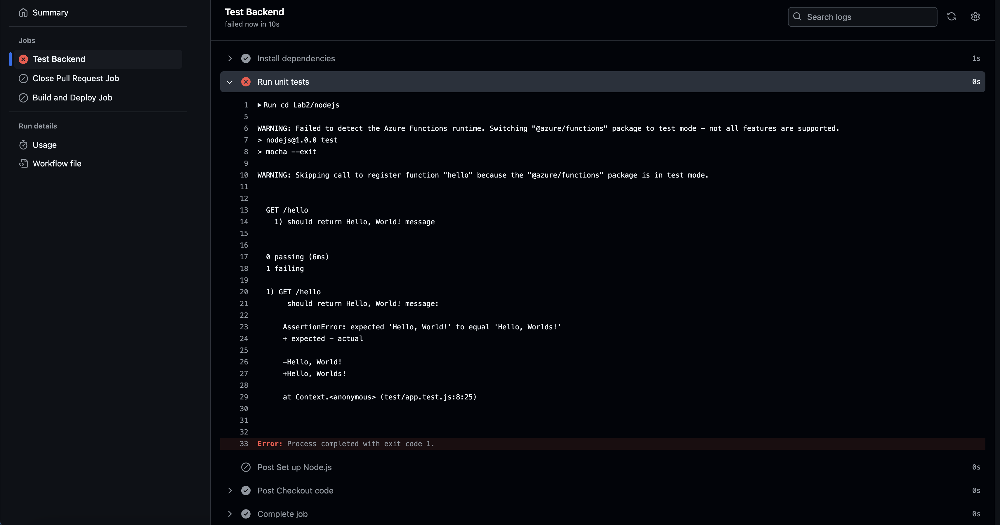
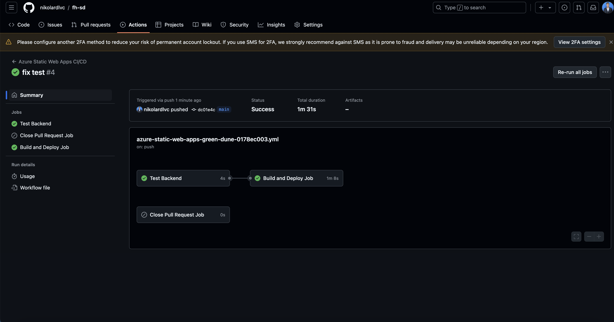
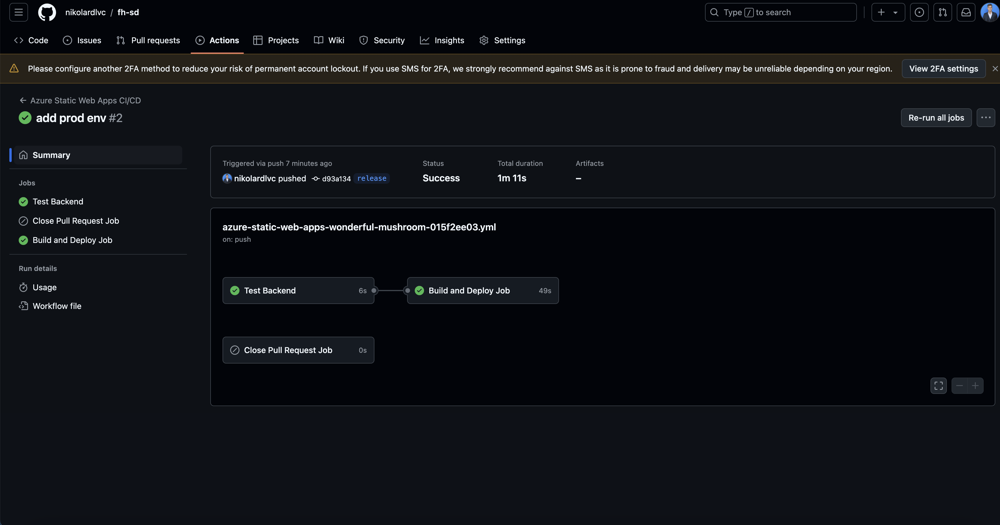

# Lab 2

## Dev-Environment

https://green-dune-0178ec003.5.azurestaticapps.net

## Prod-Environment

https://wonderful-mushroom-015f2ee03.5.azurestaticapps.net

## Screenshots

### Failed Pipeline Main

### Succeeded Pipeline Main

### Release Pipeline

## Dokumentation Freigabe Release

Bei jedem commit in den Main branch wird eine Pipeline ausgeführt. Diese pipeline führt zuerst in einem Job die Unit-Tests aus. Wenn diese Erfolgreich ausgeführt worden sind wird die akutelle Version auf die DEV instanz deployed.

Wenn der main branch in den den release branch gemerged wird, werden die selben pipelines ausgeführt mit dem Unterschied das diesmal auf die PROD instanz deployed wird.
