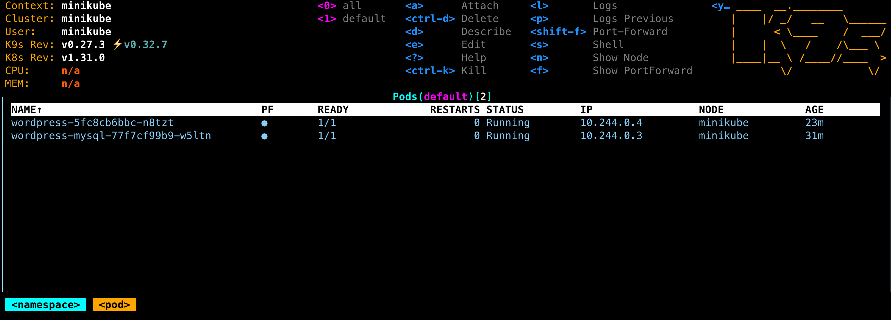

# Lab 4

## Installation von Minikube

Da dieses Lab auf einem lokal gehosteten Kubernetes-Cluster erledigt werden soll, muss dafür zuerst Minikube installiert werden. Minikube ist eine leichtgewichtete Version von Kubernetes. Die Installation kann nach der [offiziellen Anleitung](https://kubernetes.io/de/docs/tasks/tools/install-minikube/) erfolgen. Um vernünftig mit Kubernetes arbeiten zu können muss auch das Kubernetes-Cli Tool installiert werden. Hier gibt es ebenfalls eine [offizielle Installationsanleitung](https://kubernetes.io/de/docs/tasks/tools/install-kubectl/).

## Beschreibung der Dateien

### mysql-deployment.yaml

Diese Datei beinhaltet die spezifikation für die MySQL Datenbank. Auf welchem Port die Datenbank rennen soll, das Docker-Image und die Umgebungsvariablen werden in der spezifikation definiert.

### wordpress-deployment.yaml

Diese Datei beinhaltet die spezifikation für die Wordpress Instanz. Auf welchem Port die Instanz rennen soll, das Docker-Image und die Umgebungsvariablen werden in der spezifikation definiert.

## Deployment

Das Deployment erfolgt mit dem kubectl befehl, `kubectl apply -f mysql-deployment.yaml` und `kubectl apply -f wordpress-deployment.yaml`.

Mit dem kubectl befehl `kubectl get pods/deployments/service` können die jeweiligen Ressourcen verifiziert werden.

Nachfolgend eine Abbildung die das erfolgreiche Deployment von MySQL und Wordpress zeigt.

